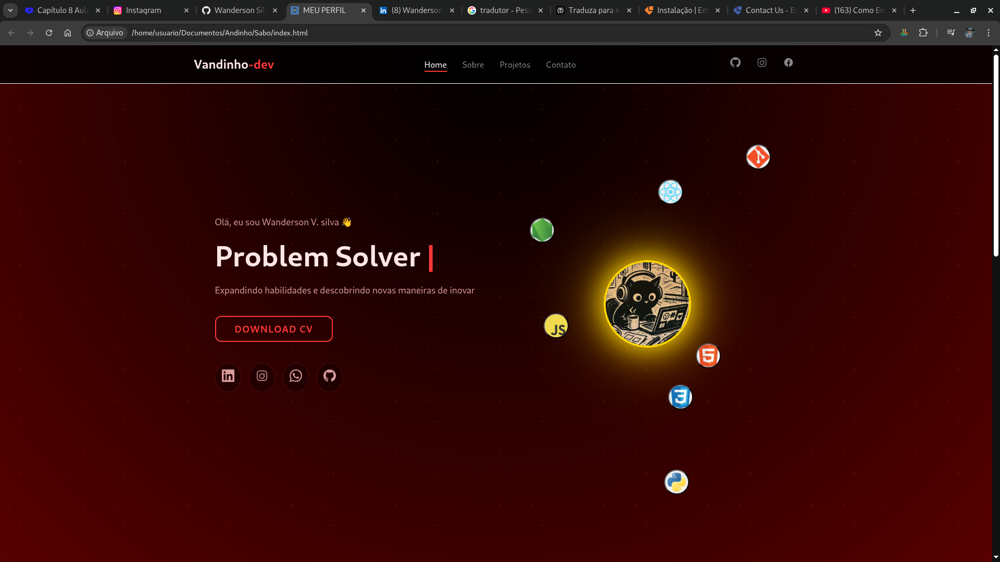

# 🌌 Portfólio de Andinho

Bem-vindo ao meu **site de portfólio pessoal**, uma vitrine moderna dos meus projetos, habilidades e informações de contato.  
O site apresenta animações suaves, efeitos de digitação, design responsivo e um tema limpo em vermelho escuro.

---

## 🔗 Demonstração ao Vivo
Você pode visualizar o portfólio localmente abrindo `index.html` em um navegador moderno.  
Ou acessar a demonstração online aqui: [Demonstração ao Vivo](https://andinhoo24.github.io/wandersonvsilva/)

---

## 🚀 Recursos

- ⚡ **Design Responsivo** — Funciona perfeitamente em todos os dispositivos  
- 🎨 **Efeito de Digitação** — Texto animado para mostrar habilidades  
- 🌍 **Rolagem Suave** — Navegação fluida entre seções  
- 💻 **Estrutura Limpa** — HTML, CSS e JS modulares  
- 📧 **Formulário de Contato** — Integrado com [EmailJS](https://www.emailjs.com/) para mensagens instantâneas  

---

## 🧠 Stack Tecnológica

| Categoria | Ferramentas |
|------------|-------------|
| **Frontend** | HTML5, CSS3, JavaScript (ES6+) |
| **Animações** | CSS keyframes, IntersectionObserver |
| **Manipulação de Formulário** | EmailJS |
| **Implantação** | GitHub Pages |
